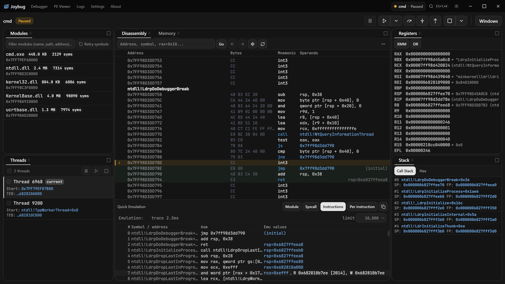

<div align="center">


# Joybug

**A modern Windows debugger for x64 and ARM64, with a UI that's a pleasure to work in.**


</div>

<picture>
  <source media="(prefers-color-scheme: dark)" srcset="docs/images/ui-dark.png">
  <source media="(prefers-color-scheme: light)" srcset="docs/images/ui-light.png">
  
</picture>

---

## Why Joybug

**A UI you can arrange.** Dockable, tiled panels you drag where you want them — and that stay there, per session. A `Ctrl+K` command palette that reaches every panel and every debug action. Both **WinDbg and x64dbg keybinding presets** ship side by side, fully rebindable, so you don't have to relearn anything. Light and dark themes, UI zoom, and drag-and-drop an EXE onto the window to start debugging it. Under the hood it's a native Rust binary rendering through the OS WebView, so it stays light.

**ARM64 Windows feels at home.** ARM64 gets the same attention as x64 throughout — the disassembler, the register views (NEON `V0`–`V31` alongside x64's XMM), hardware breakpoints and watchpoints, the emulator, and the PE parser. CI builds and runs the E2E suite on both ARM64 and x64 Windows runners, so the two stay in step.

**Analysis built in.** CPU emulation, module-wide code coverage, inline-hook detection, and Cheat Engine-style memory scanning are all dock tabs, ready when you want them — and anything you'd rather not run on your own machine can be detonated inside a disposable Windows Sandbox with ETW tracing on. Joybug borrows liberally from the tools it admires; see [Prior art & inspiration](#prior-art--inspiration).

---

## Features

### Analysis

- **Emulation** — Unicorn-backed forward emulation of the *live* process state. A footer under the disassembly answers "where does this land, which syscall does it hit, which module does it transition to" without letting the target run. Five modes: basic, instruction trace, basic block, stop on module transition, and stop on first syscall.
- **Image Patches** — continuously diffs every loaded module's executable sections against its on-disk PE. Inline hooks, EDR/AV detours, packers, and self-modifying code get highlighted right in the disassembly and listed in their own panel, with one-click restore of the original bytes. Because it diffs against the on-disk image rather than tracking your own edits, it surfaces changes you didn't make as well as ones you did.
- **Code Explorer** — a module-wide execution map. Arms coverage breakpoints across every function in a module and shows live hit counts, first-execution ordering, and which threads hit what — a workflow that usually means reaching for DynamoRIO, Pin, or Lighthouse, available here as a tab.
- **Access Trace** — Cheat Engine's "find out what accesses this address," brought into a debugger. A silent hardware watchpoint accumulates every distinct accessing instruction — with symbol, disassembly, hit count and thread — while the target keeps running. On x64, where the CPU traps *after* the access, Joybug back-steps to attribute the real accessing instruction.
- **Scanning** — the Cheat Engine workflow, natively: an iterative value scanner (11 compare types including Unknown Initial Value and float tolerance), a multi-level pointer-path scanner with filter and rescan, and bookmarks whose frozen values the debug server keeps rewriting while the target runs. Plus a string scanner over selectable scopes (one module / all modules / readable / writable / executable / private / mapped / custom range) and byte-pattern search.

### Debugging

- **Stepping** — Go, Step Into / Over / Out, Go-passing-exception-to-the-debuggee, plus source-level Step Over Line and Step Into Line.
- **Breakpoints** — software, single-shot, hardware (Execute / Write / ReadWrite, 1/2/4/8 bytes), and source-line, with naming, grouping, bulk enable/disable, and persistence across restarts.
- **Memory** — a hex editor you can open several of at once, with byte/word/dword/qword/float/pointer views, in-place writes, copy-as-hex/text/dump, and a region map with **semantic annotations** (module, section, TEB, PEB, heap, stack, `KUSER_SHARED_DATA`) instead of a wall of undifferentiated VADs.
- **Registers & stacks** — inline register editing, XMM / NEON / debug-register views, pointer dereference chains, and symbolized call stacks for any thread.
- **Symbols & types** — symbol-server integration with a configurable cache path, `_NT_SYMBOL_PATH` fallback, and an offline mode for air-gapped work. Manual PDB load with GUID/age validation and a force-override. PDB source-line view that warns when the on-disk source doesn't match the build. A live struct overlay across PDB UDTs, built-in `_TEB` / `_PEB` / `KUSER_SHARED_DATA` anchors, and **user-defined types you paste in as C**.
- **Patching** — an inline Keystone assembler (type `mov eax, 1` at an instruction), with NOP padding, undo, and grouped enable/disable.

### Sessions & targets

- **Launch, attach by PID, or open non-invasively** — a non-invasive session uses only `OpenProcess`: no `DebugActiveProcess`, so the usual debugger checks come up clean and detaching can't kill the target. Browse memory, modules, strings, and scans — then **promote it to a full attach in place** when you want breakpoints. Restart the target, or detach and leave it running.
- **Most panels keep working while the target runs.** An out-of-band connection pool means memory reads, module lists, symbol status, bookmark values, scans, and coverage all update live — you don't have to break in first.
- **Anti-anti-debug** — PEB hiding (`BeingDebugged`, `NtGlobalFlag`, heap flags, StartupInfo, OS build number) is a settings toggle.
- **Remote debugging by design** — point a session at a debug server on another machine and every panel behaves exactly as it does locally. A local session takes the same path over loopback, so there is no separate "remote mode" to fall behind the rest of the app.

### Sandboxed detonation & tracing

- **Run or debug inside a real Windows Sandbox.** Joybug provisions a disposable VM, shares the target in, and either attaches the full debugger to it over TCP — same panels, same stepping, the target's window visible on the sandbox desktop — or just launches it and watches. Your machine is untouched, and the VM is torn down with the session.
- **ETW tracing of the whole process tree.** Process, file, registry and network activity, selectable per individual operation rather than by coarse category, with optional callstacks that symbolize to `module!func+0x…`. Tracing follows the tree transitively and outlives its root, so a dropper that spawns a successor and exits immediately is followed to the end of the chain instead of being truncated at its first process.
- **Cross-process access.** Opt in to the *Sensitive APIs* group and every `OpenProcess` / `OpenThread` is logged with its decoded access mask — `VM_OPERATION|VM_READ|VM_WRITE` against *another* process is the signature of injection or credential theft. (The reads and writes themselves aren't in ETW: those live in a provider only a signed anti-malware process may consume.)
- **Tracing without a VM.** The same collector attaches to a local debuggee, or runs standalone with no debugger at all, as a lightweight Procmon.

### Standalone PE reader

Open a PE without running it. Symbolic header field editing by name (`opt.AddressOfEntryPoint`, `section.2.Characteristics`), byte patching, disassembly at a VA with symbols, string scanning, and save. Handles ARM64 PE32+ identically to x64, and opens 32-bit PE32 (x86) images with their narrower headers, 4-byte IAT thunks and 32-bit disassembly.

---

## Getting started

### Download

Grab the latest build from the [Releases page](https://github.com/org62/joybug-tauri/releases), or use the permalinks:

| Host | Download |
| --- | --- |
| x64 | [`Joybug-UI-x64.exe`](https://github.com/org62/joybug-tauri/releases/latest/download/Joybug-UI-x64.exe) |
| ARM64 | [`Joybug-UI-aarch64.exe`](https://github.com/org62/joybug-tauri/releases/latest/download/Joybug-UI-aarch64.exe) |

Each has a `.sha256` sidecar next to it. It's a single portable `.exe` — no installer, nothing to uninstall. It updates itself in place: the update dialog downloads the new build, checks it against the `.sha256`, and swaps it in. Requires the WebView2 runtime, which ships with Windows 11.

Download the build that matches **your machine's** architecture — see [Scope & limits](#scope--limits).

### Build from source

```bash
git clone --recurse-submodules https://github.com/org62/joybug-tauri
cd joybug-tauri
npm install
npm run tauri dev      # or: npm run tauri build
```

**Prerequisites.** The debugger core links Capstone, Keystone, Unicorn, and Lua natively, so the build needs more than Rust and Node:

- Windows, a Rust MSVC toolchain, and Node.js.
- Visual Studio with **both** the MSVC and the **LLVM/Clang** components.
- **`LIBCLANG_PATH` must point at the libclang matching your host architecture** — the core's `build.rs` panics outright without it, and an ARM64 libclang on an x64 host fails with "invalid DLL".
- Build from an MSVC developer shell (`Launch-VsDevShell.ps1 -Arch arm64`, or `vcvars64.bat`) — `build.rs` also compiles C test programs with `cl.exe`.
- **On ARM64:** Keystone's bundled CMakeLists requires CMake < 4, which modern Visual Studio no longer ships. Install one alongside (`pip install cmake==3.31.6`), put it first on `PATH`, and set `CMAKE_GENERATOR=Ninja`.
- Two dependencies (a Unicorn fork and a pelite fork) are pulled from GitHub rather than crates.io, so the build needs network access.

---

## Scope & limits

Joybug is early-stage and deliberately narrow. What that means concretely:

- **Windows only.**
- **x64, ARM64 and 32-bit x86 (WOW64) debuggees.** A 64-bit build debugs a 32-bit (WOW64) target through its 32-bit register file — registers, stepping, breakpoints, call stack, symbols, hex, emulation, hardware breakpoints, patches, pointer scanning and PEB hiding all work on it. For a **native 64-bit** target **the host architecture must still match** (the core writes breakpoints and single-steps natively, so an ARM64 build does not correctly debug an emulated x64 target, or vice versa); a WOW64 x86 target is fine on either host.
- **No ARM64EC support.**
- **Sandbox mode needs Windows 11 24H2** (build 26100+) with the *Windows Sandbox* optional feature installed, and Windows permits only one sandbox per user at a time.
- **Tracing on the host needs admin.** Kernel ETW providers require elevation, so host tracing prompts for it. Tracing inside the sandbox does not — that guest is already privileged.
- Ships as a bare `.exe` — there is no installer or MSI.
- Expect rough edges.

---

## Architecture

```
React + TypeScript UI  ──Tauri IPC──▶  Rust backend (src-tauri)
                                              │
                                     embedded joybug-core server
                                    (framed JSON over TCP)  ◀── or a remote host
                                              │
                                      Windows debug APIs
```

The frontend is a Tauri client: it `invoke()`s Rust command handlers, which forward typed commands into a debug session loop and emit events back. Panels listen for those events and re-render.

The debugger itself lives in [`external/joybug-core`](https://github.com/org62/joybug-core) — a Rust library and TCP server handling process control, stepping, breakpoints, memory, and symbols behind a framed-JSON protocol. It uses **Capstone** for disassembly, **Keystone** for assembly, **Unicorn** for emulation, and `pdb` + `symsrv` for symbols. Because the UI talks to it over a socket, a local session just spins up an embedded server on an ephemeral loopback port — and a remote session points at a different machine with no other changes.

Because the UI and the debug server are already separate over a socket, the sandbox reuses that split rather than shipping a second debugger: Joybug copies **its own exe** into the guest and launches it with `--listen` for the debug server or `--out` for the ETW collector, either of which runs headless instead of the GUI. One binary does all three jobs, guest and host are the same build by construction, and the download carries no duplicate copy of the debugger.

The core also ships **`jlua`**, a Lua REPL exposing the full debugger API, plus `sbx` and `etw` globals that drive the sandbox and the tracer from a script. It's a core binary today, not yet surfaced in the GUI.

---

## Tech stack

Tauri v2 · Rust · React 18 · TypeScript · Vite · Tailwind CSS v4 · shadcn/ui · rc-dock · Playwright

---

## Development

```bash
npm run tauri dev      # Vite dev server + Tauri
npm run lint           # ESLint, including the UI layout guardrails
npm run test:e2e       # Playwright suite (~6 min, runs against a release build)
```

See [`CLAUDE.md`](CLAUDE.md) for architecture notes and project conventions.

---

## Prior art & inspiration

Very little here is a new idea. Joybug mostly gathers workflows that already exist into one place, on a modern UI, with ARM64 along for the ride — the ideas themselves are borrowed, gratefully:

- **[x64dbg](https://x64dbg.com)** — the benchmark for an approachable Windows user-mode debugger. Its keyboard layout ships as a built-in preset, and its patch manager, inline assembler, and general panel vocabulary shaped the equivalents here.
- **[Cheat Engine](https://cheatengine.org)** — the source of the whole scanning workflow: iterative first/next scans with unknown-initial-value, multi-level pointer scanning, value freezing, and "find out what accesses this address." Memory Scanner, Pointer Scan, Bookmarks, and Access Trace are all descendants.
- **[WinDbg](https://learn.microsoft.com/windows-hardware/drivers/debugger/)** — the default keybinding preset, and the model for symbol-server handling and type/struct inspection.
- **[Lighthouse](https://github.com/gaasedelen/lighthouse)** and **[Tenet](https://github.com/gaasedelen/tenet)** — the coverage-visualization idea behind Code Explorer, and the trace format Joybug's emulator exports.
- **[ScyllaHide](https://github.com/x64dbg/ScyllaHide)** — the anti-anti-debug technique set behind the PEB-hiding toggle.

And the engines doing the actual heavy lifting: **[Capstone](https://www.capstone-engine.org)** (disassembly), **[Keystone](https://www.keystone-engine.org)** (assembly), and **[Unicorn](https://www.unicorn-engine.org)** (emulation).

---

## License

**TBD.** No license has been chosen yet; all rights reserved for now.
