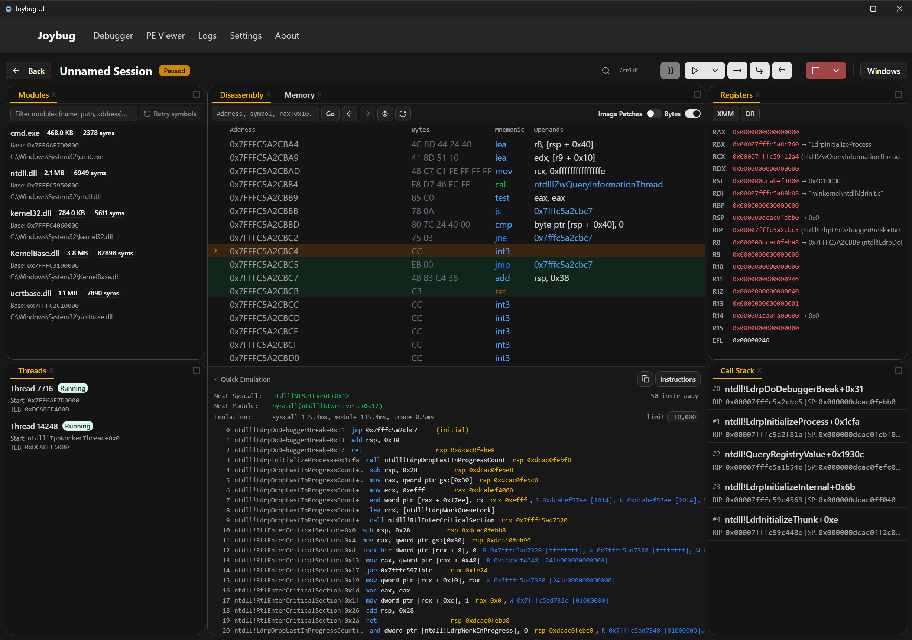

<div align="center">


# Joybug

**A modern Windows debugger — x64 and ARM64 — with a UI that isn't from 2003.**


</div>



---

## Why Joybug

**A real UI.** Dockable, tiled panels you drag where you want them — and that stay there, per session. A `Ctrl+K` command palette that reaches every panel and every debug action. Both **WinDbg and x64dbg keybinding presets** shipped side by side, fully rebindable, so you don't relearn anything. Light and dark themes, UI zoom, drag-and-drop an EXE onto the window to start debugging it. It's a native Rust binary rendering through the OS WebView — not Electron.

**ARM64 Windows, properly.** Not a port afterthought: ARM64 is first-class in the disassembler, the register views (NEON `V0`–`V31` alongside x64's XMM), hardware breakpoints and watchpoints, the emulator, and the PE parser. Every commit builds *and runs the full E2E suite* on both ARM64 and x64 Windows runners.

**Analysis built in.** CPU emulation, module-wide code coverage, inline-hook detection, and Cheat Engine-style memory scanning are dock tabs — not plugins you go hunting for. Joybug borrows liberally from the tools it admires; see [Prior art & inspiration](#prior-art--inspiration).

---

## Features

### Analysis

- **Emulation** — Unicorn-backed forward emulation of the *live* process state. A footer under the disassembly answers "where does this land, which syscall does it hit, which module does it transition to" without executing anything. Five modes: Basic, InstructionTrace, BasicBlock, ModuleTransition or until first Syscall.
- **Image Patches** — continuously diffs every loaded module's executable sections against its on-disk PE. Inline hooks, EDR/AV detours, packers, and self-modifying code get highlighted right in the disassembly and listed in their own panel, with one-click restore of the original bytes. Where x64dbg's patch manager tracks the edits *you* made, this diffs against the on-disk image — so it catches everyone else's too.
- **Code Explorer** — a module-wide execution map. Arms coverage breakpoints across every function in a module and shows live hit counts, first-execution ordering, and which threads hit what. Normally a DynamoRIO/Pin/Lighthouse workflow; here it's a tab.
- **Access Trace** — Cheat Engine's "find out what accesses this address," brought into a debugger. A silent hardware watchpoint accumulates every distinct accessing instruction — with symbol, disassembly, hit count and thread — while the target keeps running. On x86, where the CPU traps *after* the access, Joybug back-steps to attribute the real accessing instruction.
- **Scanning** — the Cheat Engine workflow, natively: an iterative value scanner (11 compare types including Unknown Initial Value and float tolerance), a multi-level pointer-path scanner with filter and rescan, and bookmarks with server-side value freeze. Plus a string scanner over selectable scopes (one module / all modules / readable / writable / executable / private / mapped / custom range) and byte-pattern search.

### Debugging

- **Stepping** — Go, Step Into / Over / Out, Go-passing-exception-to-the-debuggee, plus source-level Step Over Line and Step Into Line.
- **Breakpoints** — software, single-shot, hardware (Execute / Write / ReadWrite, 1–8 bytes), and source-line, with naming, grouping, bulk enable/disable, and persistence across restarts.
- **Memory** — a hex editor you can open several of at once, with byte/word/dword/qword/float/pointer views, in-place writes, copy-as-hex/text/dump, and a region map with **semantic annotations** (module, section, TEB, PEB, heap, stack, `KUSER_SHARED_DATA`) instead of a wall of undifferentiated VADs.
- **Registers & stacks** — inline register editing, XMM / NEON / debug-register views, pointer dereference chains, and symbolized call stacks for any thread.
- **Symbols & types** — symbol-server integration with a configurable cache path, `_NT_SYMBOL_PATH` fallback, and an offline mode for air-gapped work. Manual PDB load with GUID/age validation and a force-override. PDB source-line view that warns when the on-disk source doesn't match the build. A live struct overlay across PDB UDTs, built-in `_TEB` / `_PEB` / `KUSER_SHARED_DATA` anchors, and **user-defined types you paste in as C**.
- **Patching** — an inline Keystone assembler (type `mov eax, 1` at an instruction), with NOP padding, undo, and grouped enable/disable.

### Getting at the process

- **Launch, attach by PID, or open non-invasively** — a non-invasive session uses only `OpenProcess`: no `DebugActiveProcess`, so nothing detects a debugger and detaching can't kill the target. Browse memory, modules, strings, and scans — then **promote it to a full attach in place** when you want breakpoints. Restart the target, or detach and leave it running.
- **Most panels keep working while the target runs.** An out-of-band connection pool means memory reads, module lists, symbol status, bookmark values, scans, and coverage all update live — you don't have to break in first.
- **Anti-anti-debug** — PEB hiding (`BeingDebugged`, `NtGlobalFlag`, heap flags, StartupInfo, OS build number) is a settings toggle, not a plugin.
- **Remote debugging by design** — the debug core is a JSON-framed TCP server and the UI is just a client, so a session can point at another machine. Local runs spin up an embedded server on a loopback port.

### Standalone PE reader

Open a PE without running it. Symbolic header field editing by name (`opt.AddressOfEntryPoint`, `section.2.Characteristics`), byte patching, disassembly at a VA with symbols, string scanning, and save. Handles ARM64 PE32+ identically to x64.

---

## Getting started

### Download

Grab the latest build from the [Releases page](https://github.com/org62/joybug-tauri/releases), or use the permalinks:

| Host | Download |
| --- | --- |
| x64 | [`Joybug-UI-x64.exe`](https://github.com/org62/joybug-tauri/releases/latest/download/Joybug-UI-x64.exe) |
| ARM64 | [`Joybug-UI-aarch64.exe`](https://github.com/org62/joybug-tauri/releases/latest/download/Joybug-UI-aarch64.exe) |

Each has a `.sha256` sidecar next to it. It's a single portable `.exe` — no installer, nothing to uninstall. Requires the WebView2 runtime, which ships with Windows 11.

Download the build that matches **your machine's** architecture — see [Scope & limits](#scope--limits).

### Build from source

```bash
git clone --recurse-submodules https://github.com/org62/joybug-tauri
cd joybug-tauri
npm install
npm run tauri dev      # or: npm run tauri build
```

**Prerequisites.** The debugger core links Capstone, Keystone, Unicorn, and Lua natively, so the build needs more than Rust and Node:

- Windows, a Rust MSVC toolchain, and Node.js.
- Visual Studio with **both** the MSVC and the **LLVM/Clang** components.
- **`LIBCLANG_PATH` must point at the libclang matching your host architecture** — the core's `build.rs` panics outright without it, and an ARM64 libclang on an x64 host fails with "invalid DLL".
- Build from an MSVC developer shell (`Launch-VsDevShell.ps1 -Arch arm64`, or `vcvars64.bat`) — `build.rs` also compiles C test programs with `cl.exe`.
- **On ARM64:** Keystone's bundled CMakeLists requires CMake < 4, which modern Visual Studio no longer ships. Install one alongside (`pip install cmake==3.31.6`), put it first on `PATH`, and set `CMAKE_GENERATOR=Ninja`.
- Two dependencies (a Unicorn fork and a pelite fork) are pulled from GitHub rather than crates.io, so the build needs network access.

---

## Scope & limits

Joybug is early-stage and deliberately narrow. What that means concretely:

- **Windows only.**
- **x64 and ARM64 debuggees** — and **the host architecture must match the target's**. The core writes breakpoints and single-steps natively, so an ARM64 build does not correctly debug an emulated x64 target, or vice versa.
- **No 32-bit / WOW64 targets.** WOW64 processes are detected but treated as 64-bit, and features that depend on the 64-bit PEB layout are skipped for them.
- **No ARM64EC support.**
- Ships as a bare `.exe` — there is no installer or MSI.
- Expect rough edges.

---

## Architecture

```
React + TypeScript UI  ──Tauri IPC──▶  Rust backend (src-tauri)
                                              │
                                     embedded joybug2 server
                                    (framed JSON over TCP)  ◀── or a remote host
                                              │
                                      Windows debug APIs
```

The frontend is a Tauri client: it `invoke()`s Rust command handlers, which forward typed commands into a debug session loop and emit events back. Panels listen for those events and re-render.

The debugger itself lives in [`external/joybug2`](https://github.com/org62/joybug-core) — a Rust library and TCP server handling process control, stepping, breakpoints, memory, and symbols behind a framed-JSON protocol. It uses **Capstone** for disassembly, **Keystone** for assembly, **Unicorn** for emulation, and `pdb` + `symsrv` for symbols. Because the UI talks to it over a socket, a local session just spins up an embedded server on an ephemeral loopback port — and a remote session points at a different machine with no other changes.

The core also ships **`jlua`**, a Lua REPL exposing the full debugger API. It's a core binary today, not yet surfaced in the GUI.

---

## Tech stack

Tauri v2 · Rust · React 18 · TypeScript · Vite · Tailwind CSS v4 · shadcn/ui · rc-dock · Playwright

---

## Development

```bash
npm run tauri dev      # Vite dev server + Tauri
npm run lint           # ESLint, including the UI layout guardrails
npm run test:e2e       # Playwright suite (~6 min, runs against a release build)
```

See [`CLAUDE.md`](CLAUDE.md) for architecture notes and project conventions.

---

## Prior art & inspiration

Very little here is a new idea. Joybug's contribution is putting these workflows in one place, on a modern UI, with ARM64 treated as a first-class target — the ideas themselves are borrowed, gratefully:

- **[x64dbg](https://x64dbg.com)** — the benchmark for an approachable Windows user-mode debugger. Its keyboard layout ships as a built-in preset, and its patch manager, inline assembler, and general panel vocabulary shaped the equivalents here.
- **[Cheat Engine](https://cheatengine.org)** — the source of the whole scanning workflow: iterative first/next scans with unknown-initial-value, multi-level pointer scanning, value freezing, and "find out what accesses this address." Memory Scanner, Pointer Scan, Bookmarks, and Access Trace are all descendants.
- **[WinDbg](https://learn.microsoft.com/windows-hardware/drivers/debugger/)** — the default keybinding preset, and the model for symbol-server handling and type/struct inspection.
- **[Lighthouse](https://github.com/gaasedelen/lighthouse)** and **[Tenet](https://github.com/gaasedelen/tenet)** — the coverage-visualization idea behind Code Explorer, and the trace format Joybug's emulator exports.
- **[ScyllaHide](https://github.com/x64dbg/ScyllaHide)** — the anti-anti-debug technique set behind the PEB-hiding toggle.

And the engines doing the actual heavy lifting: **[Capstone](https://www.capstone-engine.org)** (disassembly), **[Keystone](https://www.keystone-engine.org)** (assembly), and **[Unicorn](https://www.unicorn-engine.org)** (emulation).

---

## License

**TBD.** No license has been chosen yet; all rights reserved for now.
